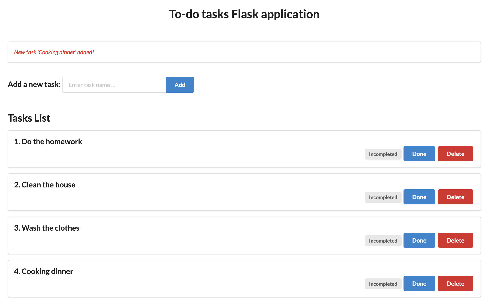

# Sample Python to-do application

This is a sample To-do application written in Python, using Flask framework.

### Deploy the application with Docker

Run below command to start the application

```bash
docker run -d -p 8080:8080 --name todo trungtin1011/to-do:1.0.0
```

### Screenshots

On first launch


<br>

When tasks added



### References

1. [Todo list app using Flask | Python](https://www.geeksforgeeks.org/todo-list-app-using-flask-python/)
2. [The Flask Mega-Tutorial series 2024](https://blog.miguelgrinberg.com/post/the-flask-mega-tutorial-part-i-hello-world)
3. [Github sample application](https://github.com/a7medayman6/Todo-List-Dockerized-Flask-WebApp/tree/master)
